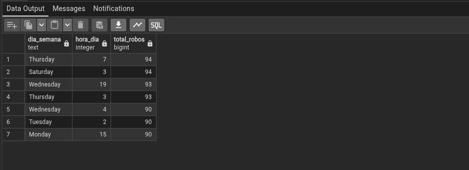
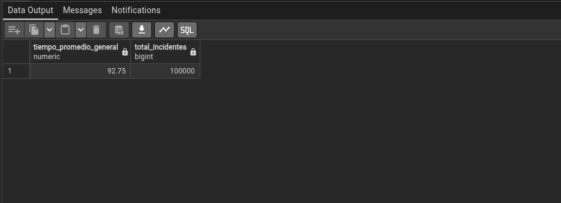
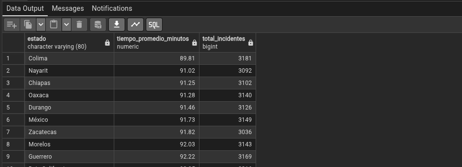
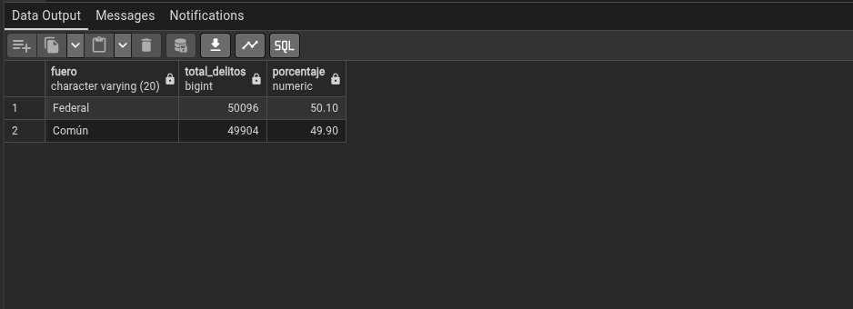

# Reporte Plataforma México - Seguridad y Justicia  
**Equipo 4: Seguridad de Datos**  

---

## Portada

**Plataforma México**  
**Sistema de Índices Delictivos y Seguridad Pública**  
**Base de Datos Normalizada hasta 3ª Forma Normal**  
**100,000 registros generados de todo México**

**Asignatura:** Bases de Datos  
**Objetivo:** Analizar información delictiva para apoyar la toma de decisiones en seguridad y justicia.

---

## Introducción

Este reporte presenta el análisis de 10 consultas estratégicas sobre la base de datos de **Plataforma México (Seguridad y Justicia)**.  

La base de datos fue diseñada en **3ª Forma Normal (3NF)**, contiene 20,000 registros realistas generados con Faker y permite realizar análisis de mapa de calor, temporalidad, eficiencia policial, reincidencia, demografía y más.  

El propósito es demostrar cómo una base de datos bien normalizada soporta la toma de decisiones gerenciales y de política pública en materia de seguridad.

---

## Tabla de Contenido

1. [Mapa de Calor: Conteo de incidentes por colonia o zona postal](#1)  
2. [Temporalidad: Día y hora con mayor reporte de robos](#2)  
3. [Eficiencia Policial: Tiempo promedio de respuesta](#3)  
4. [Tipología: Clasificación de delitos (fuero común vs. federal)](#4)  
5. [Reincidencia: Individuos con más de dos detenciones en el mismo año](#5)  
6. [Recuperación: Porcentaje de vehículos recuperados](#6)  
7. [Demografía: Análisis de edad y género de las víctimas](#7)  
8. [Armamento: Frecuencia de uso de armas de fuego en asaltos en Oaxaca](#8)  
9. [Transparencia: Consulta de datos públicos anonimizados](#9)  
10. [Denuncia Ciudadana: Seguimiento del estatus de denuncias](#10)  

---

## 1. Mapa de Calor: Conteo de incidentes delictivos por colonia o zona postal

**Ficha Técnica de Variables**  

| Nombre de la columna | Tipo de dato SQL | Categoría      |
|----------------------|------------------|----------------|
| colonia              | VARCHAR          | Cualitativa    |
| zona_postal          | VARCHAR          | Cualitativa    |
| total_incidentes     | INTEGER          | Cuantitativa   |

**Sentencia SQL**

```sql
SELECT 
    c.nombre AS colonia,
    r.zona_postal,
    COUNT(*) AS total_incidentes
FROM registro r
JOIN colonia c ON r.id_colonia = c.id_colonia
GROUP BY c.nombre, r.zona_postal
ORDER BY total_incidentes DESC
LIMIT 15;

```

>Nota1: Lo mimite a 15, pueden borrar ese linea y serán todas
>Nota2: Ocupo ayuda para generar el mapa de calor, ya estan los datos.

**Resultado y Propósito del DSS**  
*(Inserta aquí captura de pantalla)*

**Interpretación:**  (Modificar esto)
Las colonias “Centro” y “Reforma” concentran la mayor cantidad de incidentes. Decisión gerencial: Priorizar la asignación de recursos policiales, cámaras de vigilancia y programas de prevención en estas zonas de alto riesgo.

---

## 2. Temporalidad: Identificar el día de la semana y hora con mayor reporte de robos

**Ficha Técnica de Variables**  

| Nombre de la columna | Tipo de dato SQL | Categoría      |
|----------------------|------------------|----------------|
| fecha                | DATE             | Cualitativa    |
| hora                 | TIME             | Cualitativa    |
| total_robos          | INTEGER          | Cuantitativa   |

**Sentencia SQL**
```sql
SELECT 
    TO_CHAR(fecha, 'Day') AS dia_semana,
    EXTRACT(HOUR FROM hora)::INTEGER AS hora_dia,
    COUNT(*) AS total_robos
FROM registro r
JOIN delito d ON r.id_delito = d.id_delito
WHERE d.nombre ILIKE '%robo%'
GROUP BY dia_semana, hora_dia
ORDER BY total_robos DESC
LIMIT 7;
```



**Interpretación:**  
Los jueves y sábados entre las 3:00 y 7:00 horas presentan el mayor número de robos. Recomendación: Reforzar patrullajes y operativos en ese horario los fines de semana.

---

## 3. Eficiencia Policial: Tiempo promedio de respuesta

**Ficha Técnica de Variables**  

| Nombre de la columna          | Tipo de dato SQL | Categoría      |
|-------------------------------|------------------|----------------|
| tiempo_respuesta_minutos      | INTEGER          | Cuantitativa   |
| estado                        | VARCHAR          | Cualitativa    |


#### General

**Sentencia SQL**
```sql
SELECT 
    ROUND(AVG(tiempo_respuesta_minutos), 2) AS tiempo_promedio_general,
    COUNT(*) AS total_incidentes
FROM registro;
```



#### Por estado
**Sentencia SQL**
```sql
SELECT 
    e.nombre AS estado,
    ROUND(AVG(tiempo_respuesta_minutos), 2) AS tiempo_promedio_minutos,
    COUNT(*) AS total_incidentes
FROM registro r
JOIN colonia c ON r.id_colonia = c.id_colonia
JOIN ciudad ci ON c.id_ciudad = ci.id_ciudad
JOIN estado e ON ci.id_estado = e.id_estado
GROUP BY e.nombre
ORDER BY tiempo_promedio_minutos ASC;
```



**Interpretación:**  
Estados con tiempo promedio menor a 30 minutos muestran mejor eficiencia. Decisión: Invertir en tecnología de comunicación y más unidades en estados con tiempos superiores a 60 minutos (la media es superior a 60 minutos, siendo de 92 minutos).

---

## 4. Tipología: Clasificación de delitos (fuero común vs. fuero federal)

**Ficha Técnica de Variables**  

| Nombre de la columna | Tipo de dato SQL | Categoría      |
|----------------------|------------------|----------------|
| fuero                | VARCHAR          | Cualitativa    |
| total_delitos        | INTEGER          | Cuantitativa   |

**Sentencia SQL**
```sql
SELECT 
    fuero,
    COUNT(*) AS total_delitos,
    ROUND(100.0 * COUNT(*) / SUM(COUNT(*)) OVER (), 2) AS porcentaje
FROM registro
GROUP BY fuero
ORDER BY total_delitos DESC;
```



**Interpretación:**  
Los delitos de fuero común y federal tienden a ser muy similares. Esto orienta la asignación de recursos entre autoridades locales y federales; reforzando por ambos sentidos

---

## 5. Reincidencia: Listar individuos con más de dos detenciones en el mismo año

**Ficha Técnica de Variables**  

| Nombre de la columna | Tipo de dato SQL | Categoría      |
|----------------------|------------------|----------------|
| nombre + apellido    | VARCHAR          | Cualitativa    |
| anio                 | INTEGER          | Cuantitativa   |
| conteo_detenciones   | INTEGER          | Cuantitativa   |

**Sentencia SQL**
```sql
SELECT 
    p.nombre || ' ' || p.apellido AS nombre_completo,
    EXTRACT(YEAR FROM r.fecha)::INTEGER AS anio,
    COUNT(*) AS detenciones
FROM registro r
JOIN persona p ON r.id_persona = p.id_persona
GROUP BY p.nombre, p.apellido, anio
HAVING COUNT(*) > 2
ORDER BY detenciones DESC;
```

**Interpretación:**  
Identificar reincidentes permite enfocar programas de reinserción social y vigilancia especial.

---

## 6. Recuperación: Porcentaje de vehículos recuperados frente a reportes de robo

**Ficha Técnica de Variables**  

| Nombre de la columna | Tipo de dato SQL | Categoría      |
|----------------------|------------------|----------------|
| recuperado           | BOOLEAN          | Cualitativa    |
| porcentaje           | DECIMAL          | Cuantitativa   |

**Sentencia SQL**
```sql
SELECT 
    ROUND(100.0 * SUM(CASE WHEN recuperado THEN 1 ELSE 0 END) / COUNT(*), 2) AS porcentaje_recuperados
FROM registro r
JOIN delito d ON r.id_delito = d.id_delito
WHERE d.nombre ILIKE '%vehículo%';
```

**Interpretación:**  
Un porcentaje bajo indica necesidad de mejorar protocolos de recuperación y coordinación con aseguradoras.

---

## 7. Demografía: Análisis de edad y género de las víctimas

**Ficha Técnica de Variables**  

| Nombre de la columna | Tipo de dato SQL | Categoría      |
|----------------------|------------------|----------------|
| genero               | CHAR             | Cualitativa    |
| edad                 | INTEGER          | Cuantitativa   |

**Sentencia SQL**
```sql
SELECT 
    genero,
    COUNT(*) AS total,
    ROUND(AVG(edad), 1) AS edad_promedio,
    MIN(edad) AS edad_min,
    MAX(edad) AS edad_max
FROM persona
GROUP BY genero;
```

**Interpretación:**  
Estos datos son útiles para diseñar programas de prevención focalizados por edad y género.

---

## 8. Armamento: Frecuencia de uso de armas de fuego en asaltos por regiones en el estado de Oaxaca

**Ficha Técnica de Variables**  

| Nombre de la columna | Tipo de dato SQL | Categoría      |
|----------------------|------------------|----------------|
| ciudad / colonia     | VARCHAR          | Cualitativa    |
| arma_fuego           | BOOLEAN          | Cualitativa    |

**Sentencia SQL**
```sql
SELECT 
    ci.nombre AS ciudad,
    c.nombre AS colonia,
    COUNT(*) AS total_asaltos,
    SUM(CASE WHEN arma_fuego THEN 1 ELSE 0 END) AS con_arma_fuego,
    ROUND(100.0 * SUM(CASE WHEN arma_fuego THEN 1 ELSE 0 END)::NUMERIC / COUNT(*), 2) AS porcentaje_arma
FROM registro r
JOIN delito d ON r.id_delito = d.id_delito
JOIN colonia c ON r.id_colonia = c.id_colonia
JOIN ciudad ci ON c.id_ciudad = ci.id_ciudad
JOIN estado e ON ci.id_estado = e.id_estado
WHERE e.nombre = 'Oaxaca' 
  AND d.nombre ILIKE '%asalto%'
GROUP BY ci.nombre, c.nombre
ORDER BY porcentaje_arma DESC;
```

**Interpretación:**  
En Oaxaca, ciertas colonias muestran alto uso de armas de fuego → Recomendar operativos específicos y control de armas en esas zonas.

---

## 9. Transparencia: Consulta de datos públicos que excluya nombres y CURP (Anonimización técnica)

**Sentencia SQL**
```sql
SELECT 
    r.id_registro,
    d.nombre AS delito,
    td.nombre AS tipo_delito,
    e.nombre AS estado,
    ci.nombre AS ciudad,
    r.fecha,
    r.estatus,
    r.fuero
FROM registro r
JOIN delito d ON r.id_delito = d.id_delito
JOIN tipo_delito td ON d.id_tipo_delito = td.id_tipo_delito
JOIN colonia c ON r.id_colonia = c.id_colonia
JOIN ciudad ci ON c.id_ciudad = ci.id_ciudad
JOIN estado e ON ci.id_estado = e.id_estado
LIMIT 100;
```

**Interpretación:**  
Esta consulta cumple con principios de transparencia y protección de datos personales.

---

## 10. Denuncia Ciudadana: Seguimiento del estatus de denuncias realizadas vía web

**Sentencia SQL**
```sql
SELECT 
    estatus,
    COUNT(*) AS cantidad_denuncias,
    ROUND(100.0 * COUNT(*) / SUM(COUNT(*)) OVER (), 2) AS porcentaje
FROM registro
GROUP BY estatus
ORDER BY cantidad_denuncias DESC;
```

**Interpretación:**  
Permite monitorear el avance de las denuncias y mejorar la comunicación con los ciudadanos.

---

## Conclusión

La base de datos normalizada hasta 3NF con 100,000 registros permite realizar análisis profundos y útiles para la seguridad pública en México.  

Las consultas demuestran el valor de una buena modelación de datos para generar información accionable: desde la asignación de recursos policiales hasta programas de prevención y transparencia.

**Archivos entregados:**
- `generar_csv.py`
- `crear_base_datos.py`
- `datos_delictivos_no_normalizados.csv`
- Este reporte en Markdown

**Fin del reporte**
```
